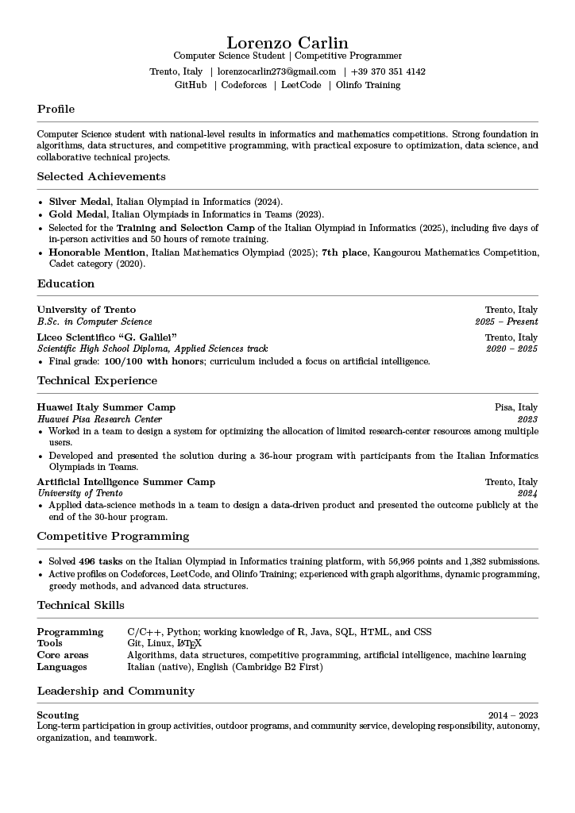

<div align="center">

# Lorenzo Carlin

### Computer Science Student · Competitive Programmer

📍 Trento, Italy

[](./pdf/Lorenzo_Carlin_CV.pdf)
[](https://github.com/lorenzo-carlin)

</div>

---

## About

I am a Computer Science student at the **University of Trento**, with a strong
interest in algorithms, data structures, competitive programming and software
development.

My background combines academic studies with practical experience in
programming, optimization, data science and artificial intelligence.

---

## Highlights

<div align="center">

| | | |
|:---:|:---:|:---:|
| 🥇 | **Gold Medal** | Italian Olympiads in Informatics in Teams · 2023 |
| 🥈 | **Silver Medal** | Italian Olympiad in Informatics · 2024 |
| 🏅 | **Honorable Mention** | Italian Mathematics Olympiad · 2025 |
| 🏕️ | **Selection Camp** | Italian Olympiad in Informatics · 2025 |
| 🎓 | **B.Sc. Computer Science** | University of Trento · 2025 – present |

</div>

---

## Curriculum Vitae

<div align="center">

[](./pdf/Lorenzo_Carlin_CV.pdf)
[](./pdf/Lorenzo_Carlin_CV_Europass.pdf)

</div>

---

## Preview

<p align="center">
  
</p>

---

## Competitive Programming

Competitive programming is an important part of my technical background.
I have participated in the **Italian Olympiad in Informatics** and regularly
practice algorithmic problem solving.

My experience includes:

- Algorithms and data structures
- Dynamic programming
- Graph algorithms
- Greedy algorithms
- Complexity analysis
- Problem solving under time constraints

---

## Profiles


[](https://atcoder.jp/users/LorenzoC)

[](https://cses.fi/user/139403)

[](https://codeforces.com/profile/LorenzoC)

[](https://open.kattis.com/users/lorenzo-carlin1)

[](https://leetcode.com/u/b5U0aS5PoL/)

[](https://training.olinfo.it/user/LorenzoC)


---

## Repository

This repository contains the latest versions of my CV in different formats and
languages.

```text
.
├── assets/
│   └── preview.png
│
├── pdf/
│   ├── Lorenzo_Carlin_CV.pdf
│   └── Lorenzo_Carlin_CV_Europass.pdf
│
├── archive/
│   ├── Lorenzo_Carlin_CV_EN.zip
│   └── Lorenzo_Carlin_CV_IT.zip
│
├── LICENSE
└── README.md
```
