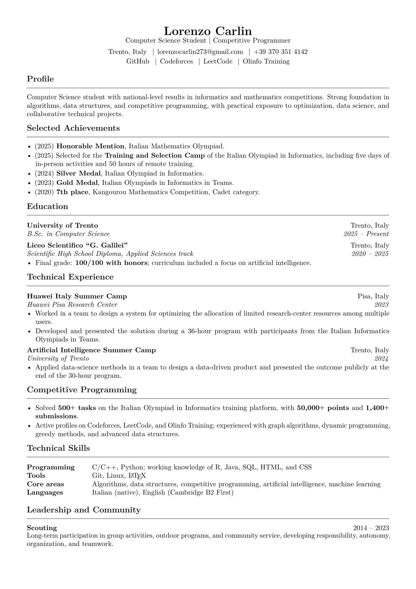

<div align="center">

# Lorenzo Carlin

### Computer Science Student · Competitive Programmer

📍 Trento, Italy

[](./pdf/Lorenzo_Carlin_CV.pdf)
[](https://github.com/lorenzo-carlin)

</div>

---

## About

I am a Computer Science student at the **University of Trento**, with a strong
interest in algorithms, data structures, competitive programming and software
development.

My background combines academic studies with practical experience in
programming, optimization, data science and artificial intelligence.

---

## Highlights

<div align="center">

<table style="border-top: 1px solid #ccc; border-bottom: 1px solid #ccc; border-collapse: collapse;">
  <tr>
    <td align="center">🥇</td>
    <td><b>Gold Medal</b></td>
    <td>Italian Olympiads in Informatics in Teams · 2023</td>
  </tr>
  <tr>
    <td align="center">🥈</td>
    <td><b>Silver Medal</b></td>
    <td>Italian Olympiad in Informatics · 2024</td>
  </tr>
  <tr>
    <td align="center">🏅</td>
    <td><b>Honorable Mention</b></td>
    <td>Italian Mathematics Olympiad · 2025</td>
  </tr>
  <tr>
    <td align="center">🏕️</td>
    <td><b>Selection Camp</b></td>
    <td>Italian Olympiad in Informatics · 2025</td>
  </tr>
  <tr>
    <td align="center">🎓</td>
    <td><b>B.Sc. Computer Science</b></td>
    <td>University of Trento · 2025 – present</td>
  </tr>
</table>

</div>

---

## Curriculum Vitae

<div align="center">

[](./pdf/Lorenzo_Carlin_CV.pdf)
[](./pdf/Lorenzo_Carlin_CV_Europass.pdf)

</div>

---

## Preview

<p align="center">
  
</p>

---

## Competitive Programming

Competitive programming is an important part of my technical background.
I have participated in the **Italian Olympiad in Informatics** and regularly
practice algorithmic problem solving.

My experience includes:

- Algorithms and data structures
- Dynamic programming
- Graph algorithms
- Greedy algorithms
- Complexity analysis
- Problem solving under time constraints

> For my online judge profiles (Codeforces, AtCoder, CSES, etc.), code solutions, and practice archives, check out my [Competitive-Programming](https://github.com/lorenzo-carlin/Competitive-Programming) repository.

---

## Repository

This repository contains the latest versions of my CV in different formats and
languages.

```text
.
├── assets/
│   └── preview.png
│
├── pdf/
│   ├── Lorenzo_Carlin_CV.pdf
│   └── Lorenzo_Carlin_CV_Europass.pdf
│
├── archive/
│   ├── Lorenzo_Carlin_CV_EN.zip
│   └── Lorenzo_Carlin_CV_IT.zip
│
├── LICENSE
└── README.md
```
